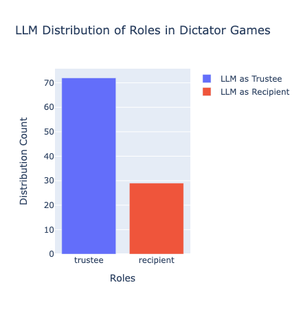
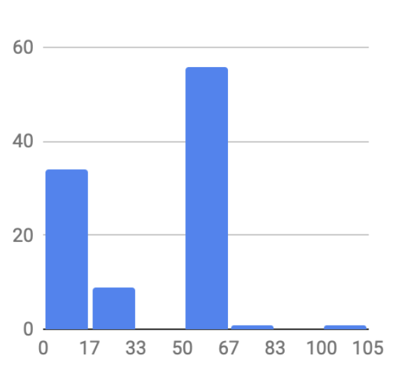
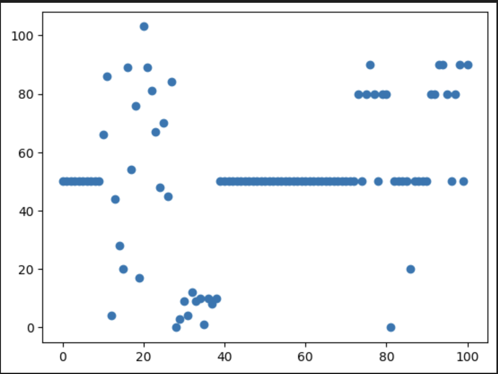
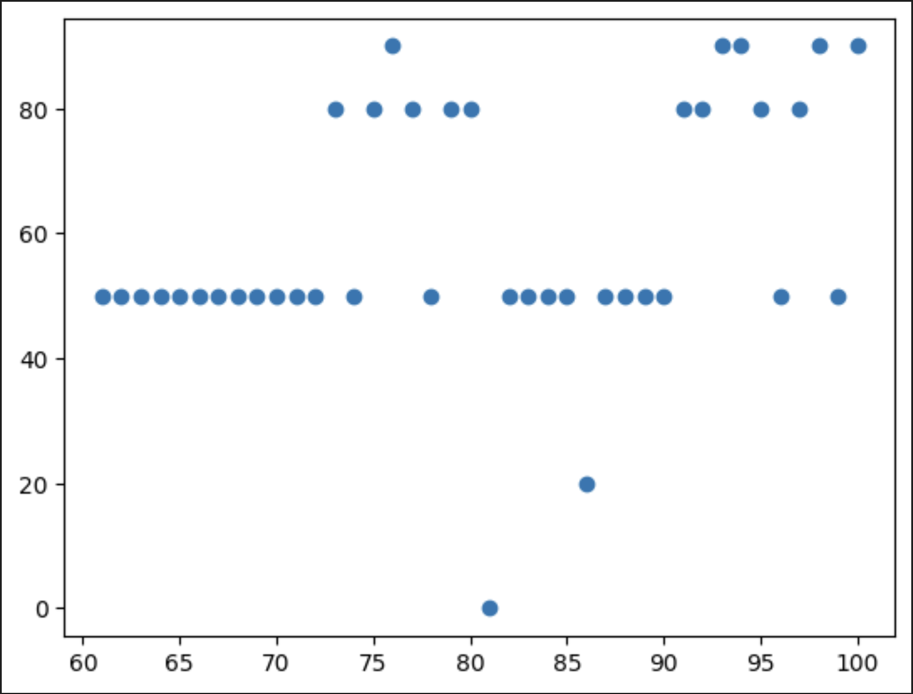

# Evaluation of Data
Below is the details of the evaluation of dictator game data. 

| Statistics | Money Given | Total Money
| ---------- | ----------- | -----------
| mean       | $44.58       | $50.86
| standard deviation    | $15.65       | $23.57
| min        | $10         | $0
| 25%        | $50         | $50
| 50%        | $50         | $50
| max        | $100        | $103

*Table 1*. Descriptive statistics of Money Given in game rounds and total money at the end of game rounds. 

In experimentation, AI proved to be a mostly fair game player. The variance across total money at the end of a round can be largely explained by the fact that the AI received random amounts of money when in the recipient role. However, when we only look at rounds when the AI is in the role of trustee and giving the money, we see a much more stable, or predictable, outcome. On average, AI gave $44.58 across all 70 rounds when it behaved as a trustee. 

Interestingly, the AI gave all of its money in a round and $10 to the recipient in a total of 5 rounds. Every round where it gave $10, it was operating as a persona in a round where the recipient was a millionaire. The one round where the AI gave all of its money was a round where the AI was assigned the Rancher persona and playing with a recipient in need. 

## Plots
Most rounds of the experiment saw the AI in the role of trustee with 70 rounds-- including 60 rounds with framed conditions-- vs 30 rounds as the recipient.

*Figure 1*. Distribution of role, trustee or recipient,  of the AI.

In most rounds, the AI behaved predictably giving $50 when given the role of trustee. This remained static even as the AI received random sums when given the role of recipient. As a result, 56 of the AI’s 70 rounds as a trustee gives $50. 

*Figure 2*. AI is predictable… until a point. 

As we can see in figure 3, the only time before round 62– when AI is given a persona– that the AI does not have $50 at the end of a round is when it has the role of recipient during rounds 10-40. 

*Figure 3*. AI is predictable up until receiving a persona. 

When the AI receives a persona, the predictability ends. During rounds 62-71, the HR AI persona gives $50 to a recipient in need. However, after round 72 with a millionaire recipient and later still with the Rancher persona with both types of recipients, the amount of money at the end of a round when the AI is the trustee is much harder to predict. 

*Figure 4*. Close up on persona round total money outcomes. The AI gives less predictably as the trustee when it has a persona. 

## Interpretation
This shows that, much like humans, framed conditions greatly affect the outcomes of AI’s game play. We can see from the regression analysis, that personas in particular have the biggest effect and a recipient being a millionaire has the strongest negative correlation with the amount of money the AI gives. 
